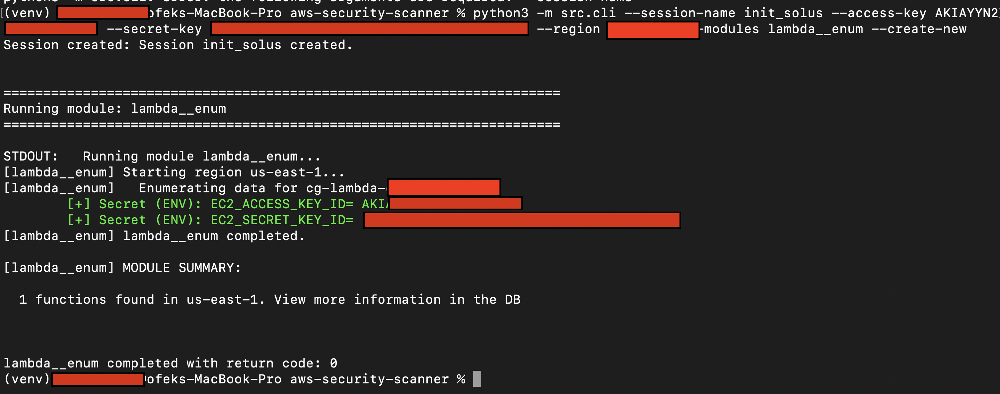
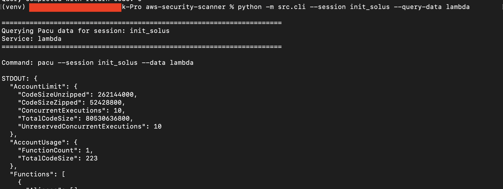

## AWS Pacu Enumeration Console

A Python CLI wrapper for [Pacu](https://github.com/RhinoSecurityLabs/pacu) that streamlines AWS security enumeration by running **enumeration-only modules** (no exploitation) and provides easy data querying capabilities with AI-powered security report generation.

### Features

- **Session Management**: Create and reuse Pacu sessions with AWS credentials
- **Module Selection**: Choose which enumeration modules to run
- **Data Querying**: Retrieve enumerated data from previous scans without re-running modules
- **AI Security Reports**: Generate reports using Ollama (local LLM)
- **Custom Prompts**: Use your own prompts for different analysis types

### Available Modules

- `lambda__enum`: Enumerate Lambda functions (requires region)
- `ec2__enum`: Enumerate EC2 instances, security groups, VPCs (requires region)
- `route53__enum`: Enumerate Route53 DNS records (requires region)
- `iam__enum_users_roles_policies_groups`: Enumerate IAM resources (region-independent)

### Prerequisites

- Python 3.10+ (recommended)
- Pacu installed and available on your PATH as `pacu`
- AWS credentials you are authorized to test
- Ollama (for AI report generation): https://ollama.ai

### Installation

```bash
python -m venv .venv
source .venv/bin/activate
pip install -r requirements.txt
```

For AI report generation, install and run Ollama:
```bash
# Install Ollama from https://ollama.ai
ollama pull qwen2.5:14b
ollama serve
```

### Project Structure

```
src/
├── __init__.py
├── cli.py          # Entry point, argument parsing
├── config.py       # Constants and configuration
├── pacu.py         # Pacu interaction functions
└── report.py       # AI report generation
```

### Usage

#### 1. Run Enumeration (Create New Session)

Run default modules (Lambda + EC2):
```bash
python -m src.cli \
  --session-name my-scan \
  --access-key YOUR_ACCESS_KEY \
  --secret-key YOUR_SECRET_KEY \
  --region us-east-1 \
  --create-new
```

Run specific modules:
```bash
python -m src.cli \
  --session-name my-scan \
  --access-key YOUR_ACCESS_KEY \
  --secret-key YOUR_SECRET_KEY \
  --region us-east-1 \
  --modules lambda__enum iam__enum_users_roles_policies_groups \
  --create-new
```

Run all available modules:
```bash
python -m src.cli \
  --session-name my-scan \
  --access-key YOUR_ACCESS_KEY \
  --secret-key YOUR_SECRET_KEY \
  --region us-east-1 \
  --modules lambda__enum ec2__enum route53__enum iam__enum_users_roles_policies_groups \
  --create-new
```

#### 2. Reuse Existing Session

Run modules on an existing session (no credentials needed):
```bash
python -m src.cli \
  --session-name my-scan \
  --modules ec2__enum route53__enum
```

#### 3. Query Enumerated Data

Query all data from a previous scan:
```bash
python -m src.cli \
  --session-name my-scan \
  --query-data all
```

Query specific service data:
```bash
# Query Lambda data
python -m src.cli --session-name my-scan --query-data lambda

# Query EC2 data
python -m src.cli --session-name my-scan --query-data ec2

# Query IAM data
python -m src.cli --session-name my-scan --query-data iam

# Query Route53 data
python -m src.cli --session-name my-scan --query-data route53
```

#### 4. Generate AI Security Report

Query data and generate a penetration testing report:
```bash
python -m src.cli \
  --session-name my-scan \
  --query-data all \
  --generate-report
```

Use a different Ollama model:
```bash
python -m src.cli \
  --session-name my-scan \
  --query-data all \
  --generate-report \
  --model llama3:8b
```

Reports are saved to the `reports/` directory with timestamps.

#### 5. Custom Prompts

Use a custom prompt instead of the default security analysis:

```bash
# Inline custom prompt
python -m src.cli \
  --session-name my-scan \
  --query-data all \
  --prompt "Analyze this AWS data for compliance issues: {pacu_data}"

# Prompt from file
python -m src.cli \
  --session-name my-scan \
  --query-data all \
  --prompt-file prompts/compliance.txt
```

**Note:** Use `{pacu_data}` as a placeholder - it gets replaced with the enumeration data.

Example prompt file (`prompts/compliance.txt`):
```
Analyze this AWS enumeration data for compliance violations:

{pacu_data}

Focus on: PCI-DSS, SOC2, HIPAA requirements.
Output as a checklist with pass/fail status.
```

### Command-Line Arguments

| Argument | Required | Description |
|----------|----------|-------------|
| `--session-name` | Yes | Name for the Pacu session |
| `--access-key` | Conditional | AWS access key ID (required with `--create-new`) |
| `--secret-key` | Conditional | AWS secret access key (required with `--create-new`) |
| `--region` | No | AWS region (default: us-east-1) |
| `--create-new` | No | Create a new session with provided credentials |
| `--modules` | No | Specific modules to run (default: lambda__enum, ec2__enum) |
| `--query-data` | No | Query data without running modules (choices: ec2, lambda, iam, route53, all) |
| `--generate-report` | No | Generate AI security report (requires `--query-data`) |
| `--model` | No | Ollama model for report generation (default: qwen2.5:14b) |
| `--prompt` | No | Custom prompt string (use `{pacu_data}` as placeholder) |
| `--prompt-file` | No | Path to file containing custom prompt |

### Workflow Example

1. **Initial enumeration scan:**
```bash
python -m src.cli \
  --session-name my-scan \
  --access-key AKIA... \
  --secret-key ... \
  --region us-east-1 \
  --create-new
```

2. **Query the enumerated data:**
```bash
python -m src.cli \
  --session-name my-scan \
  --query-data all
```

3. **Generate security report:**
```bash
python -m src.cli \
  --session-name my-scan \
  --query-data all \
  --generate-report
```

4. **Run additional modules on same session:**
```bash
python -m src.cli \
  --session-name my-scan \
  --modules route53__enum
```

- **Reports**: Saved to `reports/` directory as Markdown files with timestamps.

### Example Output

#### Running Enumeration


#### Querying Data

